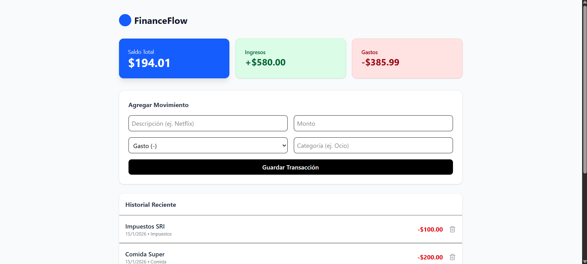

# FinanceFlow 🚀 | Personal Finance Dashboard


**FinanceFlow** is a robust Full Stack application designed to track incomes and expenses in real-time. It features a modern microservices-ready architecture using **NestJS** for the backend and **Next.js 14** for the frontend, fully containerized with **Docker** for instant deployment.

---

## 📸 Screenshots

<div align="center"> 
  
</div>

---

## 🛠 Tech Stack

### **Backend (API)**
* **Framework:** [NestJS](https://nestjs.com/) (Modular Architecture).
* **Language:** TypeScript.
* **Database:** MongoDB (via Mongoose).
* **Validation:** Class-validator & DTOs for data integrity.

### **Frontend (Client)**
* **Framework:** [Next.js 14](https://nextjs.org/) (App Router).
* **Styling:** Tailwind CSS.
* **HTTP Client:** Axios.
* **State Management:** React Hooks.

### **DevOps & Infrastructure**
* **Containerization:** Docker & Docker Compose.
* **Environment:** Multi-stage builds for optimization.

---

## ⚡️ Quick Start (Run with Docker)

You don't need Node.js or MongoDB installed on your local machine. Just **Docker**.

1.  **Clone the repository**
    ```bash
    git clone [https://github.com/YOUR_USERNAME/finance-flow.git](https://github.com/YOUR_USERNAME/finance-flow.git)
    cd finance-flow
    ```

2.  **Run the application**
    Execute the following command in the root directory:
    ```bash
    docker-compose up --build
    ```

3.  **Access the App**
    * **Frontend (Dashboard):** [http://localhost:3000](http://localhost:3000)
    * **Backend (API):** [http://localhost:3001](http://localhost:3001)

---

## 📂 Project Structure

This project follows a clean Monorepo-style structure:

```bash
finance-flow/
├── backend/                # NestJS API
│   ├── src/
│   │   ├── transactions/   # Modular Resource
│   │   ├── app.module.ts
│   │   └── main.ts
│   └── Dockerfile
├── frontend/               # Next.js Client
│   ├── src/
│   │   ├── app/            # App Router (Pages)
│   │   ├── components/     # Reusable UI Components
│   │   └── lib/            # Utilities (Axios config)
│   └── Dockerfile
└── docker-compose.yml      # Orchestration
```

## 🔌 API Endpoints

The backend exposes a RESTful API. Here are the main resources:

| Method | Endpoint | Description |
| :--- | :--- | :--- |
| `GET` | `/transactions` | Retrieve all transactions |
| `POST` | `/transactions` | Create a new transaction |
| `DELETE` | `/transactions/:id` | Remove a transaction |

---

## 🚀 Key Features

* ✅ **Real-time Calculation:** Instant updates of total balance, income, and expenses.
* ✅ **Responsive Design:** Optimized for Desktop and Mobile (Tailwind CSS).
* ✅ **Data Persistence:** Data is saved in a MongoDB volume (survives container restarts).
* ✅ **Infrastructure as Code:** Development environment fully defined in `docker-compose.yml`.


